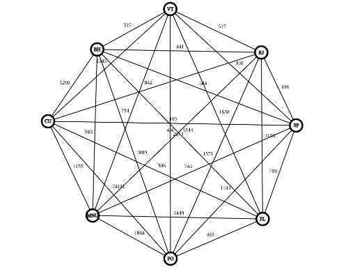

### Exercício ao vivo - passado em aula pelo professor [@Larback](https://github.com/larback)

A Gulozitos alimentos precisa que você desenvolva um sistema para indicar a rota a ser seguida por sua carreta para entregas nos centros de distribuições das capitais do sul e sudeste. A carreta sairá da fábrica em Manhuaçu, deve percorrer todas as capitais do sul e sudeste e retornar à Manhuaçu. Seu sistema deve dizer a rota a ser seguida e qual será a quilometragem percorrida.

A distância entre as cidades pode ser visualizada no grafo a seguir.



Dado o número de vértices, o grafo ficou pouco legível. Entretanto, é possível ver a matriz de adjacências do grafo aqui.

```java
int[][] distancias = {
        { 0, 283, 748, 430, 234, 1449, 1155, 1884 },
        { 283, 0, 584, 441, 515, 1344, 1208, 1809 },
        { 748, 584, 0, 446, 938, 709, 419, 1144 },
        { 430, 441, 446, 0, 517, 1136, 842, 1571 },
        { 234, 515, 938, 517, 0, 1638, 1345, 2073 },
        { 1449, 1344, 709, 1136, 1638, 0, 306, 463 },
        { 1155, 1208, 419, 842, 1345, 306, 0, 741 },
        { 1884, 1809, 1144, 1571, 2073, 463, 741, 0 }
};
```

Para solução, você deverá implementar uma heurística gulosa. A partir de Manhuaçu, escolha a cidade com a menor distância, gerando um escalonamento parcial de duas cidades, por exemplo MNU->VT. Agora selecione como próxima cidade a ser alocada, a que possuir a menor distância considerando-se as duas extremidades, ou seja, partindo de VT ou chegando à MNU. Continue o processo até que todas as cidades estejam na rota. Ao final, imprima a rota começando e terminando em MNU.